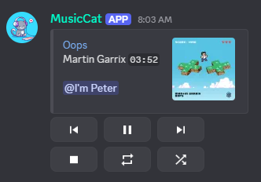
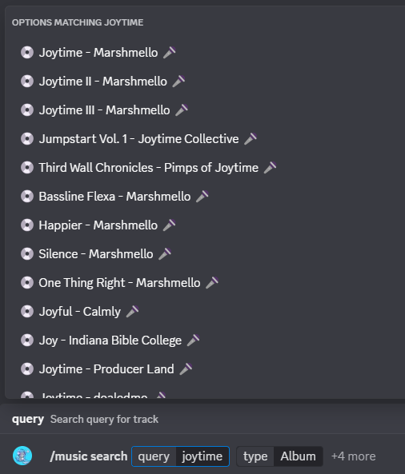

# MusicCat

A Discord music streaming bot built with [DisGo](https://github.com/disgoorg/disgo). MusicCat uses [Lavalink](https://github.com/lavalink-devs/Lavalink/tree/master) as audio source and its plugins for additional streaming platforms and features.

## FEATURES:

  
* Intuitive Discord slash commands `/` support.

* Interactive music player allows better control of playing music with buttons.

*  `/search` - Search query autocompletion allows precise track lookup:

*  `type` - type of query (track/artist/playlist/album).

*  `source` - search source to look up query (YouTube/YouTube Music/Spotify/Deezer).

* Music Tracker Integration - Share your real-time listening activity with your personal website through WebSocket connection.

* Personal music `play/pause` support - when the voice session only has you and the bot, Discord's `deafen` 🎧 pauses the player and `undeafen` resumes it.

* Sources supported: [YouTube](https://www.youtube.com/), [YouTube Music](https://music.youtube.com/), [Spotify](https://open.spotify.com/), [Deezer](https://www.deezer.com/us/) and more [here](https://github.com/lavalink-devs/lavaplayer#supported-formats)

* Playlist Management - Create, modify, and manage your personal playlists with easy-to-use commands.

> Any suggestion for cool additional features feel free to reach out!

  
### Slash (/) commands:

Bot control: `/bot/join`  `/bot/leave`  `/bot/ping`

Music control: `/music/play`  `/music/search`  `/music/pause`  `/music/resume`  `/music/skip`  `/music/stop`  `/music/seek`

Queue management: `/music/now`  `/music/queue`  `/music/remove`  `/music/shuffle`  `/music/loop`

Playlist features: `/list/add`  `/list/create`  `/list/delete`  `/list/list`  `/list/remove`

> Autocomplete support available for: `/music/remove`, `/music/search`, `/list/add`, `/list/delete`, `/list/remove`
